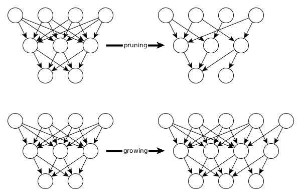

# deepstruct
Documentation for [deepstruct on github](https://github.com/innvariant/deepstruct).

### Notes
- **2022-07-05** some pruning functionality was re-activated; good examples can also be found in the testing directory
- **2022-05-05** added some simple examples as currently used in experiments
- **2020-11-22** currently documenting the package


## Introduction
Deepstruct provides tools and models in pytorch to easily work with all kinds of sparsity of neural networks.
The four major approaches in that context are 1) **pruning** neural networks, 2) defining **prior structures** on neural networks, 3) **growing** neural network structures and 4) conducting graph-neural-network **round-trips**.



## Sparse Feed-forward Neural Net for MNIST
```python
import deepstruct.sparse
from deepstruct.pruning import PruningStrategy, prune_network_by_saliency

input_size = 784
output_size = 10
model = deepstruct.sparse.MaskedDeepFFN(input_size, output_size, [200, 100])

# Prune 10% of the model based on its absolute weights
prune_network_by_saliency(model, 10, strategy=PruningStrategy.PERCENTAGE)
```

## Creating Neural Nets from Graphs
```python
import deepstruct.sparse

input_size = 5
output_size = 2
structure  = deepstruct.sparse.CachedLayeredGraph()
structure.add_nodes_from(range(20))
model = deepstruct.sparse.MaskedDeepDAN(input_size, output_size, structure)
```

## Binary Trees, Grids or Small-World Networks as Prior Structure of Neural Nets
```python
import networkx as nx
import deepstruct
import deepstruct.sparse
import deepstruct.graph

# Create a graph with networkx
graph_btree = nx.balanced_tree(r=2, h=3)
graph_grid = nx.grid_2d_graph(3, 30, periodic=False)
graph_smallworld = nx.watts_strogatz_graph(100, 3, 0.8)

# Transform it into a directed-acyclic-graph datastructure (currently necessary for deepstruct)
def get_clean_dag(nx_graph):
    struct = deepstruct.graph.CachedLayeredGraph()
    struct.add_edges_from(nx_graph.edges)
    struct.add_nodes_from(nx_graph.nodes)
    # Relabelling is necessary for graphs
    struct = nx.relabel_nodes(struct, {name: ix for ix, name in enumerate(nx_graph.nodes)})
    return struct

ds_graph_btree = get_clean_dag(graph_btree)
ds_graph_grid = get_clean_dag(graph_grid)
ds_graph_smallworld = get_clean_dag(graph_smallworld)

# Define a model based on the structure
input_shape = (5, 5)
output_size = 2
model = deepstruct.sparse.MaskedDeepDAN(input_shape, output_size, ds_graph_btree)
```


## Extract graphs from neural nets
As of *2022-05-05* this is currently only implemented on a zero-th order level of a neural network in which neurons correspond to graph vertices.
This is a very expensive transformation as for common models you will transform a model of several megabytes in efficient data storages from pytorch into a networkx graph of hundred thousands to millions of vertices.
We're working on defining other levels of sparsity and you're welcome to support us in it, e.g. write a mail to julian.stier@uni-passau.de !
```python
import torch
import deepstruct.transform as dtr

# Define a transformation object which takes a random input to pass through the model for duck-punching ("analysis")
input_shape = (5, 5)
model = None  # take the model e.g. from above
functor = dtr.GraphTransform(torch.randn((1,)+input_shape))

# Obtain the graph structure from the model as based on your transformation routine
graph = functor.transform(model)
print(graph.nodes)
```


## Available Models


## Artificial Datasets
